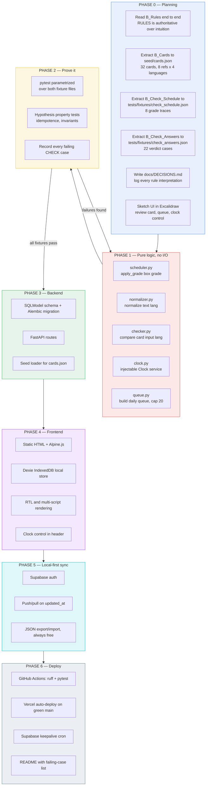
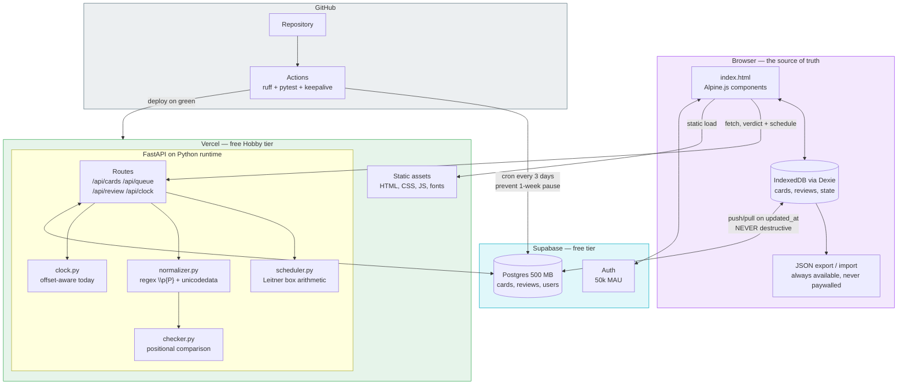
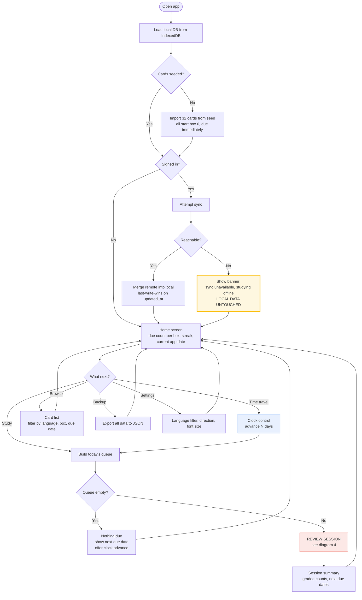
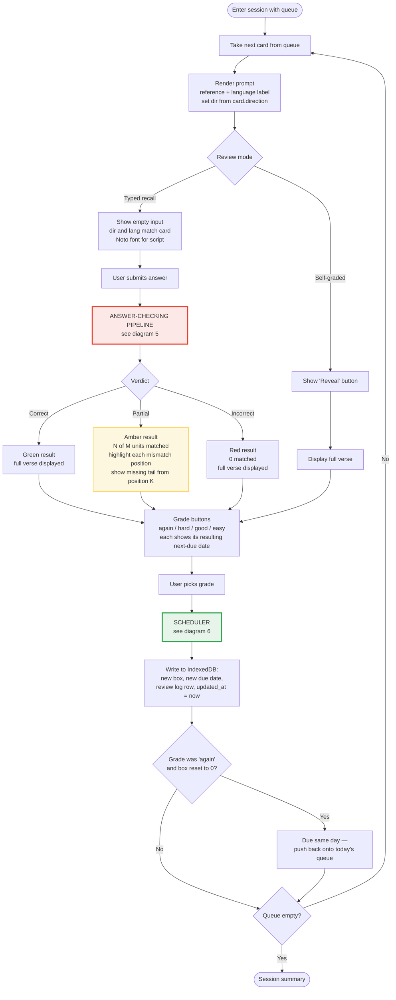
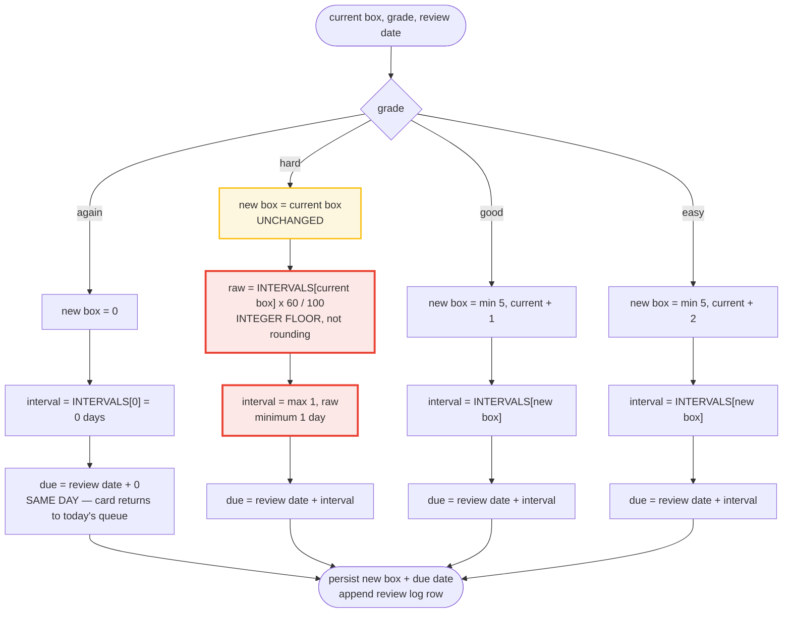
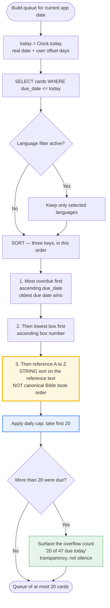
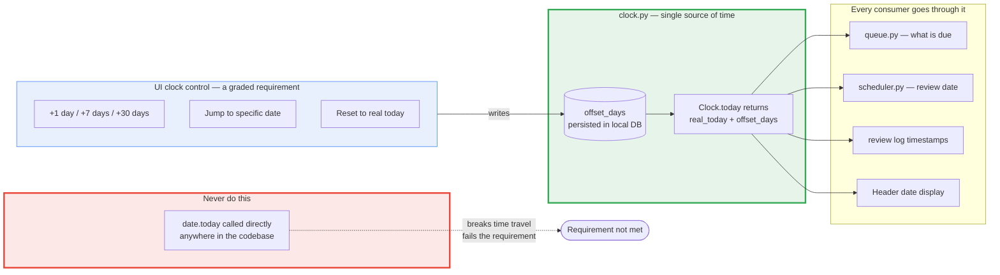
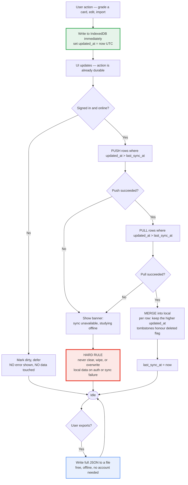
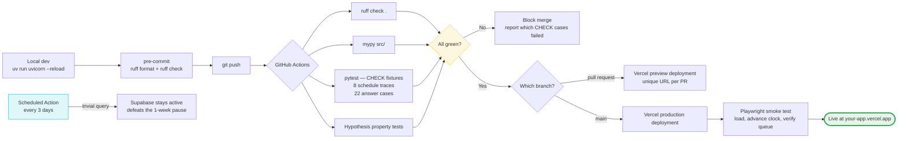

# Scripture Memory Trainer — Project Flowchart

Nine diagrams, from project lifecycle down to the character-level answer-checking pipeline. All Mermaid — they render natively on GitHub.

---

## 1. Project lifecycle — planning to production

---

## 2. System architecture

---

## 3. User journey

---

## 4. Review session loop

---

## 5. Answer-checking pipeline — the hard part

```mermaid
flowchart TD
    IN(["card.text, user.input, card.language"]) --> NFC["Unicode NFC normalize both strings<br/>Arabic and Devanagari may arrive decomposed"]

    NFC --> QUOTE["Normalize quotes<br/>U+2018 U+2019 to apostrophe<br/>U+201C U+201D to quote"]
    QUOTE --> FW["Normalize full-width forms<br/>U+FF0C to comma<br/>U+FF1B to semicolon"]

    FW --> LANGSW{"card.language"}

    LANGSW -->|ar| AR1["Strip harakat — optional diacritics<br/>U+064B through U+0652<br/>plus U+0640 tatweel, U+0670 dagger alef"]
    AR1 --> AR2["Normalize alef forms<br/>U+0671 alef wasla to U+0627 plain alef"]
    AR2 --> AR3["Normalize yeh forms<br/>U+0649 alef maqsura to U+064A yeh"]
    AR3 --> PUNCT

    LANGSW -->|hi| HI1["Strip nukta U+093C — optional"]
    HI1 --> PUNCT

    LANGSW -->|zh| ZH1["NO script conversion<br/>traditional does NOT equal simplified<br/>this is a rule, not an oversight"]
    ZH1 --> PUNCT

    LANGSW -->|en| PUNCT

    PUNCT["Strip ALL Unicode punctuation<br/>regex \\p{P} plus — every script at once<br/>ASCII, U+060C Arabic comma,<br/>U+0964 danda, U+0965 double danda,<br/>U+FF0C full-width, CJK U+3002"]

    PUNCT --> WS["Collapse whitespace runs to one space<br/>then trim both ends"]
    WS --> CASE["casefold — Unicode case folding<br/>not .lower"]

    CASE --> EQ{"normalized card<br/>==<br/>normalized input?"}
    EQ -->|Yes| CORRECT(["CORRECT"])
    EQ -->|No| SPLITSW{"Is language Chinese?"}

    SPLITSW -->|"zh — no word boundaries"| SPLITCH["Split into characters<br/>remove all spaces first"]
    SPLITSW -->|"en, ar, hi"| SPLITWD["Split on whitespace into words"]

    SPLITCH --> COMPARE
    SPLITWD --> COMPARE

    COMPARE["Positional comparison<br/>zip card units with input units<br/>walk index by index"]

    COMPARE --> COUNT["Collect:<br/>matched count<br/>1-based position of each mismatch<br/>total card units"]
    COUNT --> TAIL{"len input < len card?"}

    TAIL -->|Yes| MISSING["Missing tail:<br/>units present in card, absent from input<br/>report count and first absent position"]
    TAIL -->|No| EXTRA{"len input > len card?"}
    EXTRA -->|Yes| SURPLUS["Report surplus units beyond card length"]
    EXTRA -->|No| BUILD

    MISSING --> BUILD
    SURPLUS --> BUILD

    BUILD["Build verdict object"] --> ZERO{"matched == 0?"}
    ZERO -->|Yes| INCORRECT(["INCORRECT<br/>0 of M units matched"])
    ZERO -->|No| PARTIAL(["PARTIAL<br/>N of M matched<br/>positions: list<br/>missing from position K"])

    style PUNCT fill:#fce8e6,stroke:#ea4335,stroke-width:3px
    style ZH1 fill:#fef7e0,stroke:#fbbc04,stroke-width:3px
    style CORRECT fill:#e6f4ea,stroke:#34a853
    style PARTIAL fill:#fef7e0,stroke:#fbbc04
    style INCORRECT fill:#fce8e6,stroke:#ea4335
```

---

## 6. Leitner scheduler decision tree

### Interval table and the three traps

| Box | Interval | `hard` result (60%, floored, min 1) |
|---|---|---|
| 0 | 0 days | 0 × 0.6 = 0 → floor 0 → **min 1 day**, box stays 0 |
| 1 | 1 day | 0.6 → floor 0 → **min 1 day** |
| 2 | 3 days | 1.8 → **1 day** |
| 3 | 7 days | 4.2 → **4 days** |
| 4 | 21 days | 12.6 → **12 days**, not 13 |
| 5 | 60 days | 36.0 → **36 days** (maximum box) |

1. **`hard` reads the interval of the box the card is already in** — not a new box, and not the base interval of box 0.
2. **Floor, never round.** Box 4 hard is 12 days. Rounding gives 13 and fails trace #7.
3. **`hard` on box 0 still advances by 1 day** thanks to the minimum, while leaving the box at 0. That is trace #8: three `hard` grades walk 09-01 → 09-02 → 09-03 → 09-04, box never leaves 0.

---

## 7. Daily queue construction

**The trap in key 3:** "reference A-Z" is a plain string sort. `Isaiah 40:31` sorts before `John 3:16` before `Leviticus 19:34` before `Matthew 28:19` before `Philippians 4:13` before `Proverbs 3:5` before `Psalm 23:1` before `Romans 8:28`. That is alphabetical, not the order those books appear in scripture. Do not "helpfully" sort canonically.

**A second trap:** cards graded `again` become due the same day, so they re-enter today's queue. Decide and document whether a re-queued card counts a second time against the cap of 20. B_Rules does not say; log your reading in `DECISIONS.md`.

---

## 8. Time travel — the clock

B_Rules: *"The interface must let a reviewer advance the current date by an arbitrary number of days without editing code or system settings."* An offset stored in the DB and read through one `Clock` satisfies this, keeps tests deterministic, and means a judge can demonstrate 60-day intervals in five seconds.

---

## 9. Local-first sync and data safety

This is the direct answer to the failure mode catalogued in `leitnerboxappanalysis.md`: every data-loss report there traces to an app trusting the server over the device. Local is the source of truth; the server is a replica.

---

## 10. CI/CD pipeline

